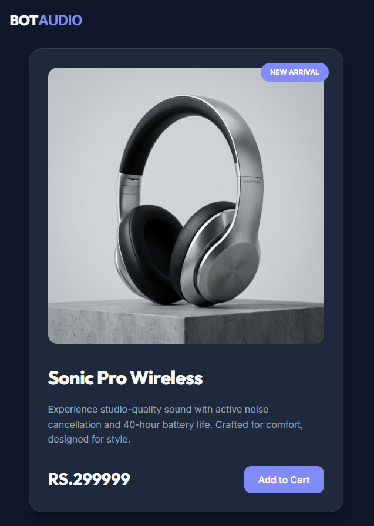
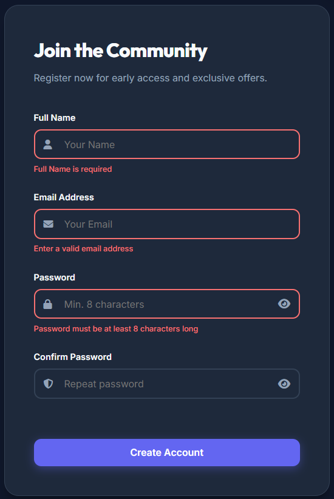

# Interactive Product Card and User Form

## Project Description
A modern, responsive web application featuring an interactive product card and a user registration form with real-time validation. This project demonstrates core web development concepts using Vanilla JavaScript, CSS3, and HTML5.

## Features
- **Product Card**:
    - Visually appealing design with "Add to Cart" functionality.
    - Interactive success messages.
    - Image fallback handling.
- **User Registration Form**:
    - Real-time client-side validation (Blur & Submit events).
    - Password visibility toggle.
    - Detailed error messaging and visual feedback.
    - Successful submission handling without page reload.
- **Theme System**:
    - Dark and Light mode toggle.
    - Persistent theme selection using `localStorage`.
- **Responsive Design**:
    - Fluid layout that adapts to various screen sizes.
    - Mobile-friendly interface.

## Technologies Used
- HTML5 (Semantic Structure)
- CSS3 (Custom Variables, Flexbox, Grid, Animations)
- JavaScript (Vanilla JS, LocalStorage, Event Handling)

## Instructions to Run the Project
1. Clone the repository to your local machine.
2. Ensure you have the following folder structure:
   ```
   project-folder/
   │
   ├── index.html
   ├── product.png
   ├── css/
   │   └── style.css
   ├── js/
   │   └── script.js
   └── README.md
   ```
3. Open `index.html` in any modern web browser.

## Screenshots

### Product Card


### Form Validation Errors


### Dark Mode


### Light Mode

